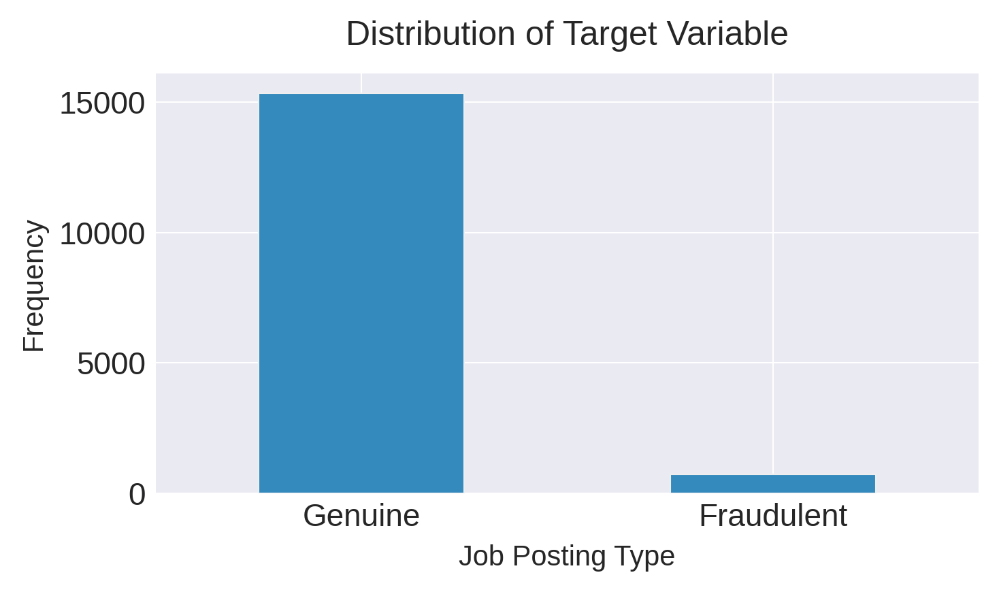
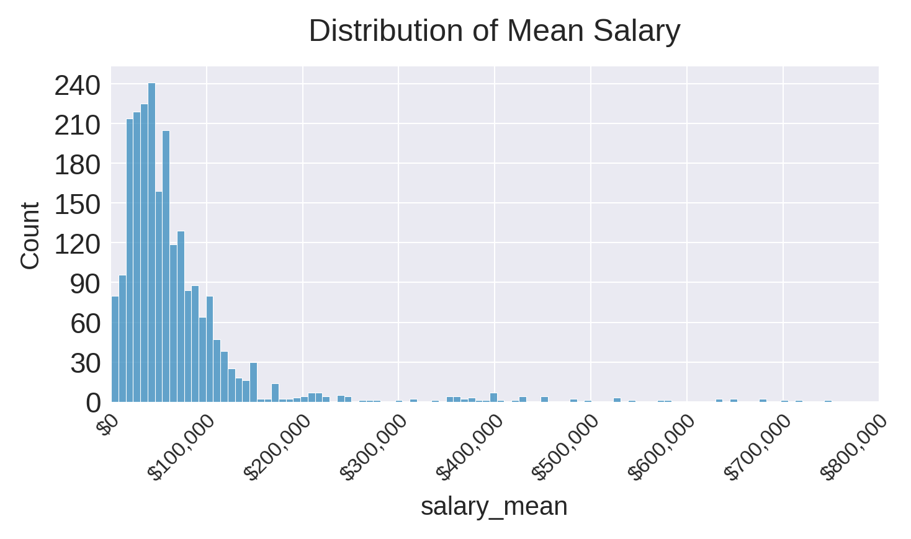
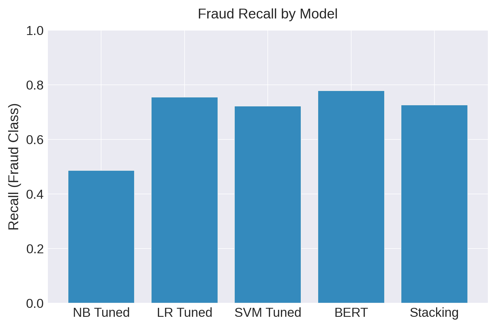
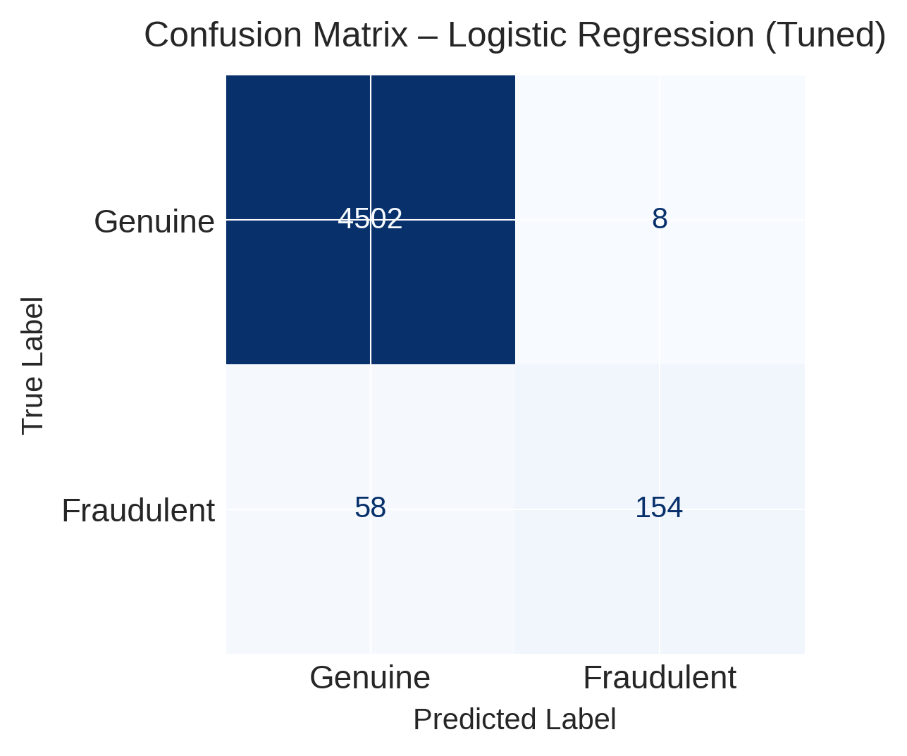
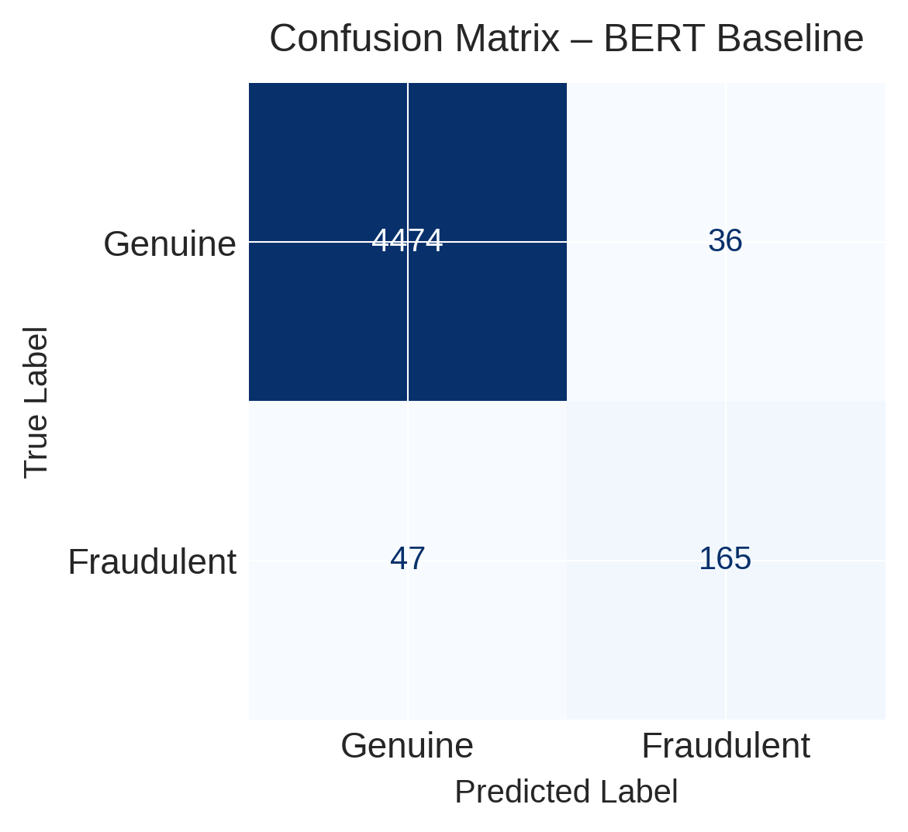
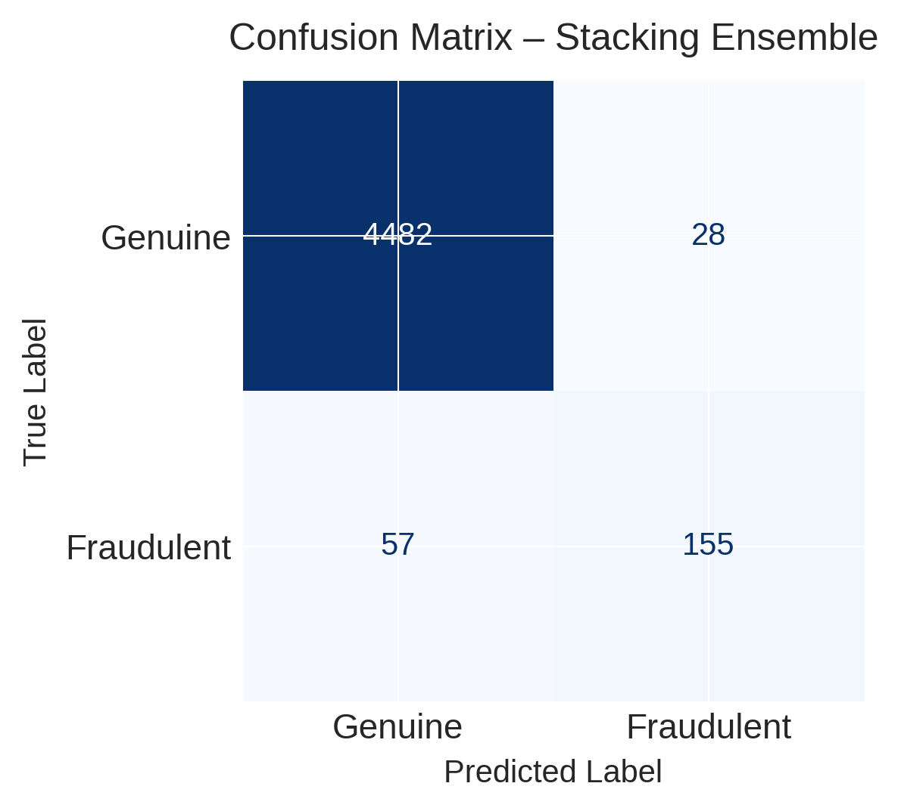

# Fake vs Real Job Postings – NLP Capstone

## Overview
Fraudulent job postings have increased significantly in recent years, making the job search process more difficult and exposing job seekers to risks such as wasted time, identity theft, and financial fraud.

The goal of this project is to **build robust NLP and machine learning models capable of classifying job postings as real or fraudulent**, with a focus on:
- handling extreme class imbalance  
- capturing nuanced linguistic patterns  
- ensuring generalizability to real-world data  

This project was completed as a Master’s capstone in Data Science and integrates traditional machine learning, transformer-based models, synthetic data augmentation, and ensemble learning.

---

## Problem Statement
Fraudulent job postings increasingly resemble legitimate opportunities, using professional tone, detailed descriptions, and realistic formatting to bypass automated filters and deceive job seekers.

This project addresses the challenge of **detecting deceptive language and behavioral patterns in job postings using NLP and machine learning, even when fraudulent examples are severely underrepresented.**

---

## Data Sources

### Primary Dataset
- **Kaggle – Real or Fake Job Posting Prediction Dataset**
  - ~17,000 genuine postings  
  - ~866 fraudulent postings  
  - Derived from the Employment Scam Aegean Dataset  
  - Severe class imbalance (~5% fraud)

### External Validation Dataset
- **USAJOBS API (Federal Job Postings)**
  - Collected via REST API (nested JSON → flattened)  
  - Used exclusively as a **generalization check**  
  - Treated as verified legitimate postings (fraud label = 0)  
  - Ensures the model does not overfit to the Kaggle distribution  

---

## Data Preprocessing & Feature Engineering

### Text Processing
All text fields were combined into a single `text_all` feature and processed using:
- lowercasing  
- punctuation and URL removal  
- tokenization (NLTK)  
- stopword removal (custom list, retaining negations such as “not”)  
- lemmatization (WordNetLemmatizer)  
- duplicate removal  

### Structured Features (Engineered)
- `salary_min`, `salary_max`, `salary_mean`  
- `salary_range_present` flag  
- binary indicators:
  - `telecommuting`
  - `has_questions`
  - `has_company_logo`

---

## Exploratory Data Analysis (EDA)
EDA was conducted to understand:
- **Class imbalance severity**  
  

- **Salary distributions**  
  

- **Fraud proportions across categorical features**
  - employment type  
  - required education  
  - required experience  
  - industry and function  

- **Binary feature behavior** (telecommuting, logos, screening questions)

These analyses revealed patterns such as:
- abnormal salary distributions  
- missing company branding  
- vague experience requirements in fraudulent postings  

---

## Modeling Approach

### Text Representation
- **TF-IDF tri-grams** to capture short deceptive phrases (e.g., “no experience required”, “immediate hire”)  
- Parameters:
  - `ngram_range = (3, 3)`  
  - `min_df = 3`  
  - `sublinear_tf = True`  

### Baseline Models
- Multinomial Naive Bayes  
- Logistic Regression (L2 regularized)  
- Linear SVM  
- Decision Tree (depth-limited)  

### Tuned Models
- GridSearchCV (3-fold) used to optimize:
  - regularization strength  
  - tree depth  
  - SVM parameters  

### Transformer Model
- **BERT (bert-base-uncased)** using Hugging Face Transformers  
  - max sequence length = 128  
  - early stopping  
  - optimized for fraud-class F1  

---

## Handling Class Imbalance: GPT-2 Augmentation
The dataset exhibited **extreme minority class underrepresentation** (~5% fraud). To address this, a **prompt-based GPT-2 synthetic data pipeline** was implemented.

### Strategy
- Model: `distilgpt2`  
- Prompt structure:

Write a fraudulent online job posting similar to the one below.
Keep the style and approximate length similar.

Example fake job posting:
[seed text]

New fake job posting:

- Fraud class expanded to ~30% of the majority class (not fully balanced to avoid noise)  
- Synthetic samples preserved stylistic and semantic patterns of real scams  

This approach was informed by recent literature demonstrating that **LLM-generated text outperforms traditional oversampling methods for NLP class imbalance tasks.**

---

## Ensemble Learning: Stacking Classifier
To combine the strengths of individual models, a stacking ensemble was built using:

**Base learners:**
- Tuned Naive Bayes  
- Tuned Logistic Regression  
- Tuned Linear SVM  
- Tuned Decision Tree  

**Meta-learner:**
- Logistic Regression  

The ensemble was trained on the **augmented dataset** and evaluated on:
- held-out Kaggle test set  
- external USAJOBS validation set  

---

## Results & Key Findings

### Model Behavior
- **Linear models (Logistic Regression, SVM)** performed best on sparse TF-IDF features  
- **Decision Trees** underfit and struggled with high-dimensional text data  
- **BERT** showed strong baseline performance with minimal gain from augmentation  
- **GPT-2 augmentation** significantly improved recall for Naive Bayes and Logistic Regression, but introduced variance in SVM and Decision Tree models  

### Ensemble Performance
- The stacking model achieved:
  - high overall accuracy  
  - strong fraud recall  
  - improved robustness compared to unstable augmented models  

### External Validation
- The stacking model maintained **~98% accuracy on USAJOBS postings**  
- Demonstrated stability and low false positive rate on verified legitimate data  

---

## Model Comparison & Evaluation

### Fraud Recall by Model

This comparison highlights the tradeoffs between classical ML models, transformer-based models, and ensemble approaches. While BERT achieved the highest fraud recall, tuned linear models and the stacking ensemble performed competitively with lower computational cost.

### Confusion Matrices

<table>
  <tr>
    <td align="center">
       
      <b>Logistic Regression (Tuned)</b>
    </td>
    <td align="center">
       
      <b>BERT Baseline</b>
    </td>
    <td align="center">
       
      <b>Stacking Ensemble</b>
    </td>
  </tr>
</table>

These confusion matrices illustrate the balance between false positives and false negatives, a critical consideration in fraud detection where missed scams can have serious consequences.

---

## Limitations & Future Work
- Lack of externally verified fraud-labeled datasets limits real-world benchmarking  
- Fraud patterns evolve; models require retraining and monitoring  

Future directions include:
- transformer fine-tuning (domain-specific BERT)  
- multi-class classification (e.g., ghost postings vs fraud vs genuine)  
- soft-voting and gradient boosting ensembles  
- fusion of structured + text features  
- real-time pipeline integration  

---

## Author
**Gabriela Nunez**  
Master’s in Data Science (Healthcare Concentration)  
Focus: NLP, machine learning, fraud detection, applied analytics
